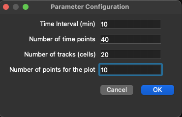

# Single Cell Migration Analysis App

A PyQt-based desktop application for analyzing cell trajectories using various quantitative metrics such as:

* **Mean Squared Displacement (MSD)**
* **Speed**
* **Directionality Ratio**
* **Autocorrelation**

This tool helps researchers and analysts efficiently process and visualize tracked cell 2D movement data.

Based on the study:  
**Quantitative and unbiased analysis of directional persistence in cell migration**  
_Roman Gorelik & Alexis Gautreau_

---

## Features

* Load data from Excel files.
* Support for multiple sheets (condition per sheet with unique track identificators).
* Trajectory plotting.
* Exportable plots (PNG).
* Migration Analyses include:

  * **Speed** with average and SEM.
  * **MSD** by cell and condition.
  * **Directionality Ratio**.
  * **Autocorrelation**.

* Statistical Tests:
    * **Mann–Whitney U test** (non-parametric version of the t-test)
    * **ANOVA**

---

# Installation Instructions

---

## 1. Running from Source (Manual Setup with Python)

If you want to run the app directly from source code, follow these steps:

### Requirements

* Python 3.10+ installed ([download Python](https://www.python.org/downloads/))
* Dependencies listed in `requirements.txt`

### Installing dependencies

```bash
git clone https://github.com/OvsPolina/cell_migration_analysis.git # or download project as a .zip (Code -> Download .zip)
cd cell_migration_analysis         # or where you unpacked .zip / cloned git repository
python -m venv venv                # create a virtual environment (recommended)
source venv/bin/activate           # macOS/Linux
venv\Scripts\activate.bat          # Windows
pip install -r requirements.txt    # install dependencies
```

### Running the application

```bash
python main.py
```

---

## 2. Running the Standalone Executable 

A ready-to-use file that does **not require Python or any dependencies installed** on your system.

### How to use

**Windows** : `CellMigrationApp.zip` (.exe in included in the archive)

1. Download `CellMigrationApp.zip` from the [Releases](https://github.com/OvsPolina/cell_migration_analysis/releases) section
2. Extract the files from the archives where you would like the programm to be.
3. Double click on the CellMigrationApp.exe
4. The app will open as a normal desktop program

> **Note:** The application will create a directory logs where app.log file will be shown. So it is better to have .exe in the folder.

**MacOS** : `CellMigrationApp`

1. Download `CellMigrationApp` from the [Releases](https://github.com/OvsPolina/cell_migration_analysis/releases) section
2. Double click on the CellMigrationApp
3. The app will open as a normal desktop program

> **Note:** Migth take up to one minute to open.


---

# Usage Instructions

Below you will find descriptions of the main interface elements along with screenshots for macOS and Windows, highlighting key buttons and their functions.

---

## Main Window Overview

The main window contains several important buttons and panels that help you load data, run analyses, and visualize results.

### Interface

  
*Figure 1: Main window on macOS.*

  
*Figure 2: Main interface on Windows.*


### File Menu

  
*Figure 3: File menu.*

* **New File**: Create a new blank project.
* **Open File**: Load a file into the application.
* **Save**: Save current work.
* **Save as**: Save under a new filename.

Buttons **New File**, **Open File**, **Save** are present in the Toolbar in the Main Window for fast acces.

  
*Figure 4: Toolbar, at the top of Main Window.*


### Edit Menu

  
*Figure 5: Edit menu.*

* **Undo / Redo**: Standard undo/redo actions.
* **Cut / Copy / Paste**: Modify data.
* **Delete**: Remove selected item.
* **Select All**: Select all items in current view.


### Analysis Menu

  
*Figure 6: Analysis menu.*

* **Autocorrelation**: Compute the persistence of direction over time.
* **Speed**: Calculate the average speed of tracked cells.
* **MSD** (Mean Squared Displacement): Measure average distance moved over time intervals.
* **Directionality Ratio**: Measure directedness of motion.

Each analyse presents a plot at the end that can be saved as PNG file.

All buttons are presented in the Toolbar in the Main Window for fast acces.


### Statistics Menu

  
*Figure 7: Statistics menu.*

* **T test**: Perform a two-sample pairwise T-test across conditions.
* **ANOVA**: Perform analysis of variance across multiple conditions. If the p-value is significant, will present Pairwise Tukey HSD test results. Otherwise will show p-value.

Each analyse presents a table at the end with the calculated results.

All buttons are presented in the Toolbar in the Main Window for fast acces.

### Plot Menu

  
*Figure 8: Plot menu.*

* **Trajectories**: Visualize cell movement tracks over time centered at (0,0).

All buttons are presented in the Toolbar in the Main Window for fast acces.

---

## Workflow

1. **Open a File**
   Use `File > Open File` or the toolbar icon to import tracking data.

     
    *Figure 9: Main interface on macOS at the start point.*

    File and condition names appear in the table and tree widgets.

      
    *Figure 10: Main interface on macOS with opened files.*

2. **Run Analyses**
   Use the **Analyse** menu or toolbar to compute movement metrics like:

   * Speed
   * MSD
   * Autocorrelation
   * Directionality Ratio

   After clicking on the needed analysis, the configuration window will appear:

     
    *Figure 11: Parameters' window.*

    Depending on the analysis, some of the parameters will be inactive.

    After choosing the parameters, the user will be asked to choose the conditions that he wants to analyse:

      
    *Figure 12: Window for choosing conditions for the analysis.*

    To choose a condition it should be clicked on in the window. The chosen conditions are higlighted. Conditions from different files can be chosen. 

    The intermediate results (calculations) will be shown directly in the table, meanwhile plots will be displayed in a special window:

      
    *Figure 13: Result plot for Migration persistence for the chosen conditions*


3. **Perform Statistical Tests**
   After analysis, use the **Statistics** menu to:

   * Compare conditions using **T test** or **ANOVA**.
   * View **p-values** in a comparison matrix.

   The user can select which parameter to analyze statistically (e.g., Speed, MSD, Directionality):

     
    *Figure 14: Parameter window for Statistics.*

    After choosing the parameters, the user will be asked to choose the conditions that he wants to analyse:

      
    *Figure 15: Window for choosing conditions for the statistics.*

    The result of the **Mann–Whitney U test** is presented as a matrix of pairwise calculated p-values:

      
    *Figure 16: Result matrix for the Mann–Whitney U test.*

    The result of the **ANOVA** is presented in 2 forms:

    1. Calculated p-value is significant, then Tukey HSD tests follows and its results are presented in the table

      
    *Figure 17: Result table for significant p-value (Tukey HSD).*

    2. Calculated p-value is not significant, then only p-value is presented:

      
    *Figure 18: Result table for not significant p-value.*
---

## Supported Input

The app expects tabular data with columns like:

* `Track n` (track ID)
* `Slice n` (frame number)
* `X`, `Y` (coordinates)

Example of the input excel file you can find in `example.xlsx` file.

## Errors

In case of errors, the work of the application can be tracked in the `logs/app.log` file 

---


## File Structure

```
cell_migration_analysis/
├── logs/
│   └── app.log
├── src/
│   ├── Analysis/
│       ├── analysis_class.py
│       ├── autocorrelation.py
│       ├── dir_ratio.py
│       ├── msd.py
│       └── speed.py
│   ├── Plot/
│       ├── plot.py
│       └── trajectories.py
│   ├── Statistics/
│       ├── anova.py
│       ├── stat_class.py
│       └── ttest.py
│   ├── utils/
│       └── input_data.py
│   ├── ui_edit.py
│   ├── ui_file.py
│   └── data_model.py
├── ui/
│   └── configuration/
│       ├── choose_sample_window.py
│       ├── choose_sample_window.ui
│       ├── configuration_autocorrelation_window.ui
│       └── configuration_autocorrelation_window.py
│   ├── main_window/
│       ├── main_window.py
│       └── main_window.ui
│   ├── plot/
│       ├── plot_window.py
│       └── plot.ui
│   └── stats/
│       ├── parameters_window.py
│       ├── parameters_window.ui
│       └── result_window.py
├── __init__.py
├── example.xlsx
├── main.py
├── logger.py
├── README.md
└── requirements.txt
```

---

### Prerequisites

* Python 3.8+
* Pip

---

## 🧩 Technologies Used

* Python 3
* PyQt6
* Matplotlib
* NumPy
* Pandas

---

## Contact

For questions or support, contact [polina.ovsiannikova0403@gmail.com](mailto:polina.ovsiannikova0403@gmail.com)

---

## References

This work is based on the study:  
**Quantitative and unbiased analysis of directional persistence in cell migration**  
_Roman Gorelik & Alexis Gautreau_  
Published in **Nature Methods**, 2014.  
[https://doi.org/10.1038/nmeth.2808](https://doi.org/10.1038/nmeth.2808)


